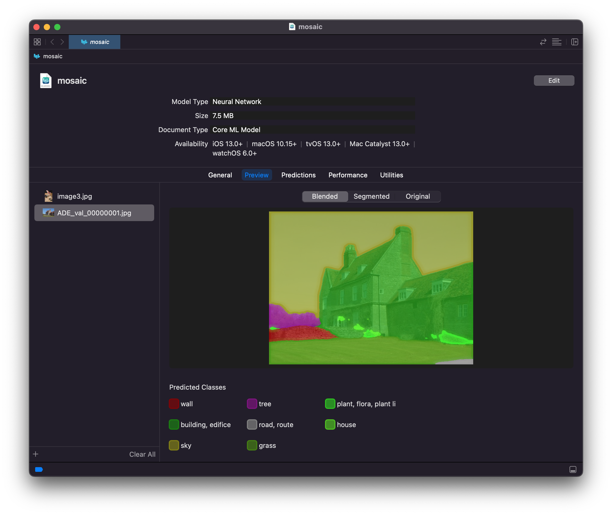

# MOSAIC Image Segmentation

* [frozen_pb](frozen_pb): frozen_pb from [mlperf mobile wg](https://github.com/mlcommons/mobile_open/tree/main/vision/mosaic/models_and_checkpoints/R4)
* [saved_model](saved_model): converted from frozen pb with [convert_pb_to_saved_model.py](convert_pb_to_saved_model.py)

* [mosaic.mlmodel](mosaic.mlmodel): input: 512x512x3 RGB, output: 513x513 INT32, works with Xcode model preview
  * converted with [mosaic.py](mosaic.py)

* [mosaic_multi_arrays.mlmodel](mosaic.mlmodel): input: 512x512x3 float32, output: 513x513x1 INT32
  * converted with [mosaic_multi_arrays.py](mosaic_multi_arrays.py)
